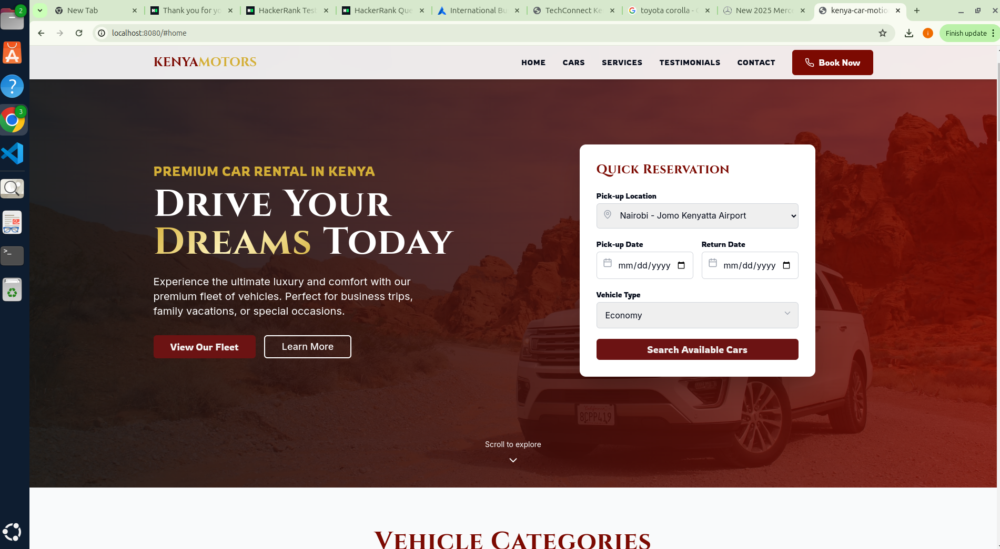
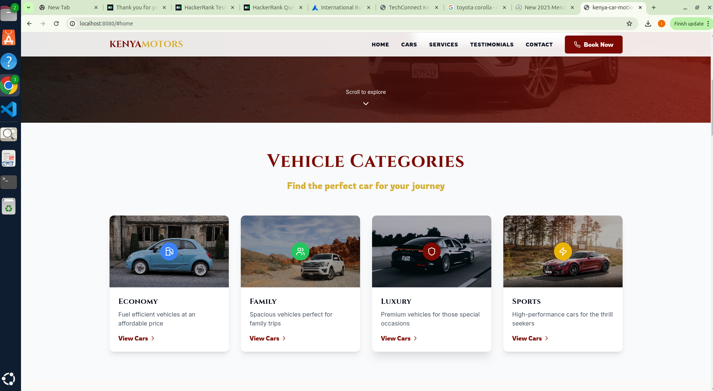
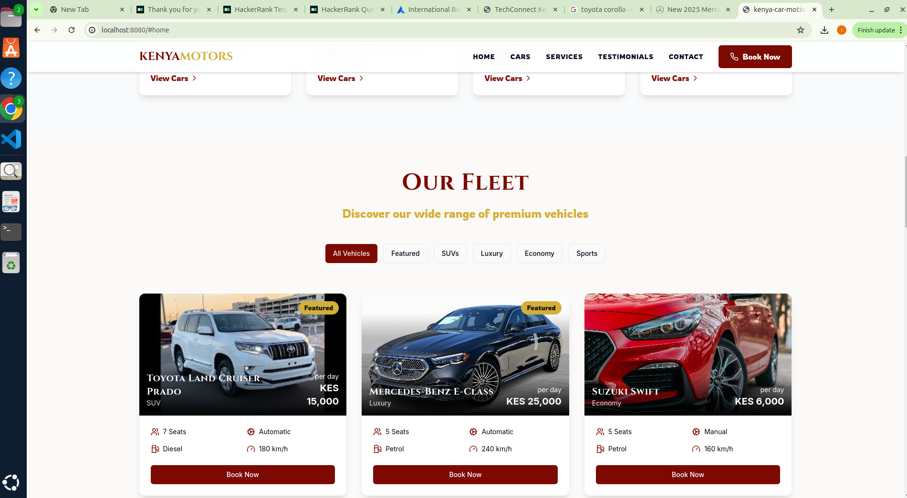
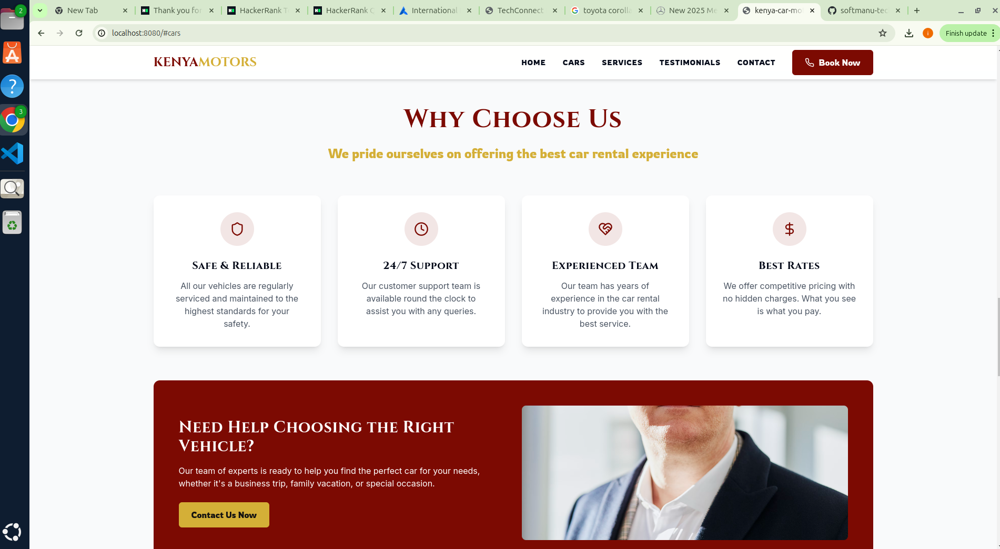
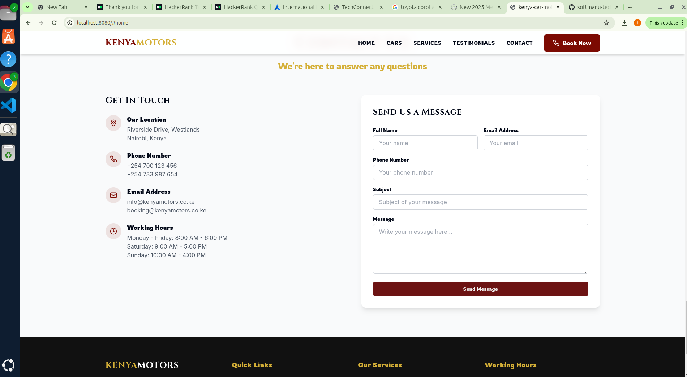

# Welcome to Work in Progress


## Project info







Follow these steps:

```sh
# Step 1: Clone the repository using the project's Git URL.
git clone <YOUR_GIT_URL>

# Step 2: Navigate to the project directory.
cd <YOUR_PROJECT_NAME>

# Step 3: Install the necessary dependencies.
npm i

# Step 4: Start the development server with auto-reloading and an instant preview.
npm run dev
```

**Edit a file directly in GitHub**

- Navigate to the desired file(s).
- Click the "Edit" button (pencil icon) at the top right of the file view.
- Make your changes and commit the changes.

**Use GitHub Codespaces**

- Navigate to the main page of your repository.
- Click on the "Code" button (green button) near the top right.
- Select the "Codespaces" tab.
- Click on "New codespace" to launch a new Codespace environment.
- Edit files directly within the Codespace and commit and push your changes once you're done.

## What technologies are used for this project?

This project is built with:

- Vite
- TypeScript
- React
- Next.js
- shadcn-ui
- Tailwind CSS

## What is the purpose of this project?

This project is a web application that allows users to upload and analyze motion data from a car. The data is then displayed in a visually appealing and interactive way, allowing users to explore and understand the motion patterns of the car.

## What are the main features of this project?

The main features of this project include:

1. User authentication and authorization: Users can create an account, log in, and access their own dashboard.
2. Upload and analyze motion data: Users can upload motion data from a car, which is then analyzed and displayed in a visually appealing and interactive way.
3. Interactive visualizations: The motion data is displayed in interactive visualizations, allowing users to explore and understand the motion patterns of the car.
4. Data visualization: The motion data is visualized using various charts and graphs, making it easy to understand and interpret the data.
5. User-friendly interface: The interface is designed to be user-friendly, with clear and concise instructions and intuitive navigation.
6. Responsive design: The design is responsive, adapting to different screen sizes and devices.
7. Accessibility: The project is accessible to users with disabilities, with features such as screen reader compatibility and keyboard navigation.
8. Data analysis: The motion data is analyzed using various algorithms and techniques, providing insights and insights into the motion patterns of the car.
9. Integration with external services: The project integrates with external services such as Google Cloud Storage and Google Cloud Vision API, allowing for seamless data upload and analysis.
10. Collaboration and version control: The project is hosted on GitHub, allowing for collaboration and version control, making it easy to track changes and collaborate with others.

## How does this project work?

This project is built using the following technologies:

- Vite: A fast and lightweight build tool for the frontend.
- TypeScript: A strongly typed superset of JavaScript that adds optional static typing to JavaScript.
- React: A JavaScript library for building user interfaces.
- Next.js: A framework for building server-side rendered React applications.
- shadcn-ui: A set of pre-built, accessible, and customizable React components.
- Tailwind CSS: A utility-first CSS framework that provides a set of predefined classes for styling HTML elements.

The project is structured as follows:

- The frontend is built using React and Next.js.
- The backend is built using Node.js and Express.
- The data is stored in Google Cloud Storage.
- The data is analyzed using Google Cloud Vision API.
- The data is visualized using various charts and graphs.

## How can I contribute to this project?

Contributions to this project are welcome! Here are some ways you can contribute:

- Report bugs or issues: If you encounter any bugs or issues, you can report them by creating a new issue on the project's GitHub repository.
- Fix bugs or issues: If you have the skills and knowledge, you can fix bugs or issues by submitting a pull request on the project's GitHub repository.
- Add new features: If you have an idea for a new feature, you can add it by submitting a pull request on the project's GitHub repository.
- Improve documentation: If you have the skills and knowledge, you can improve the documentation by submitting a pull request on the project's GitHub repository.